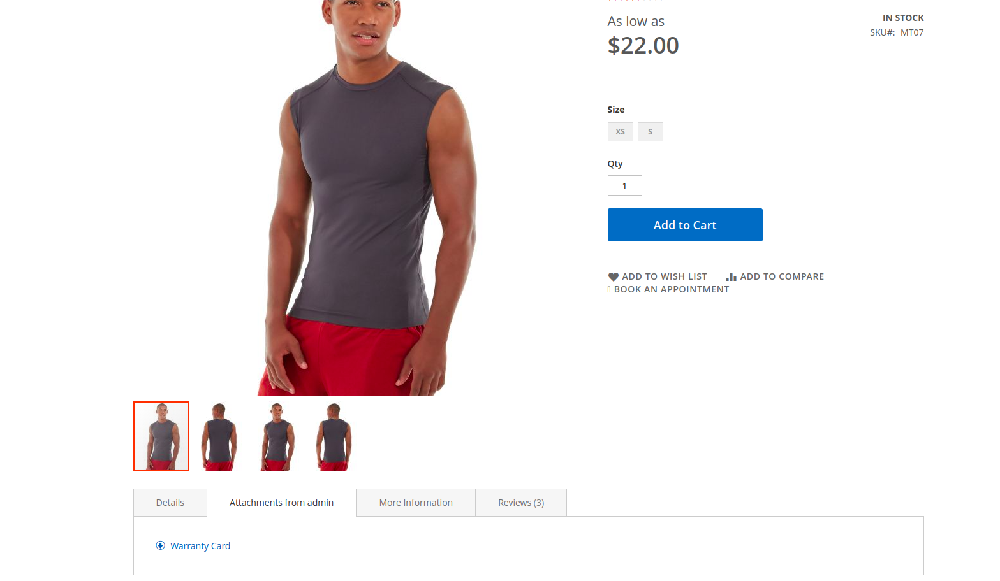
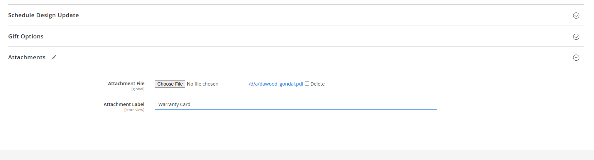
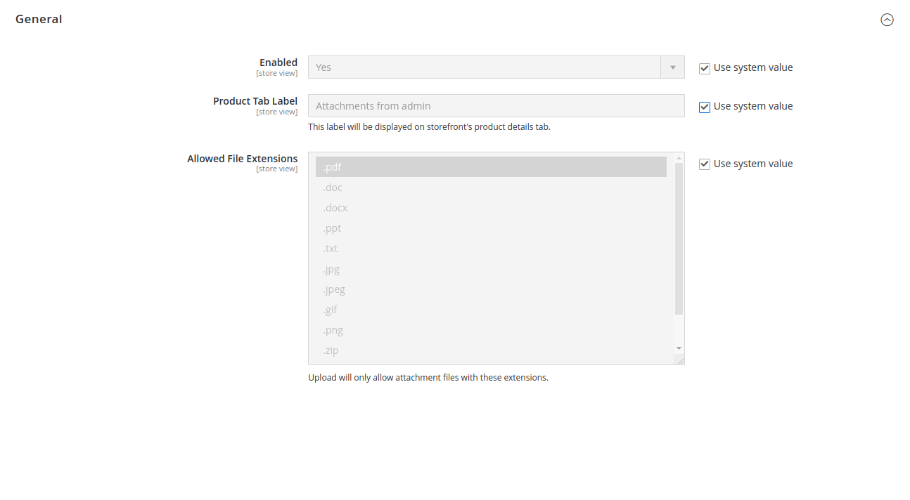

# M2Commerce Commerce: Magento 2 Product Attachments

## Overview
This extension allows attaching additional information such as manuals, warranty, recipes, etc. in different formats (`pdf`, `doc`, `jpg`, `zip`, etc.) to the product page.
With this extension, store admin can attach/upload different file types to provide additional information about the product. 
And user can view and download the attachment from the tab of the product page.

### Key Features
* Option to enable/disable the extension
* Option to attach different types of files (`pdf`, `doc`, `jpg`, `zip`, etc.)
* Option to configure attachment labels

## Configuration

There are several configuration options for this extension, which can be found at **STORES > Configuration > Commerce Enterprise > Product Attachments**.

### ScreenShots




## Installation
### Magento® Marketplace

This extension will also be available on the Magento® Marketplace when approved.

1. Go to Magento® 2 root folder
2. Require/Download this extension:

   Enter following commands to install extension.

   ```
   composer require m2commerce/product-attachments
   ```

   Wait while composer is updated.

   #### OR

   You can also download code from this repo under Magento® 2 following directory:

    ```
    app/code/M2Commerce/ProductAttachments
    ```    

3. Enter following commands to enable the module:

   ```
   php bin/magento module:enable M2Commerce_ProductAttachments
   php bin/magento setup:upgrade
   php bin/magento setup:di:compile
   php bin/magento cache:clean
   php bin/magento cache:flush
   ```

4. If Magento® is running in production mode, deploy static content:

   ```
   php bin/magento setup:static-content:deploy
   ```
